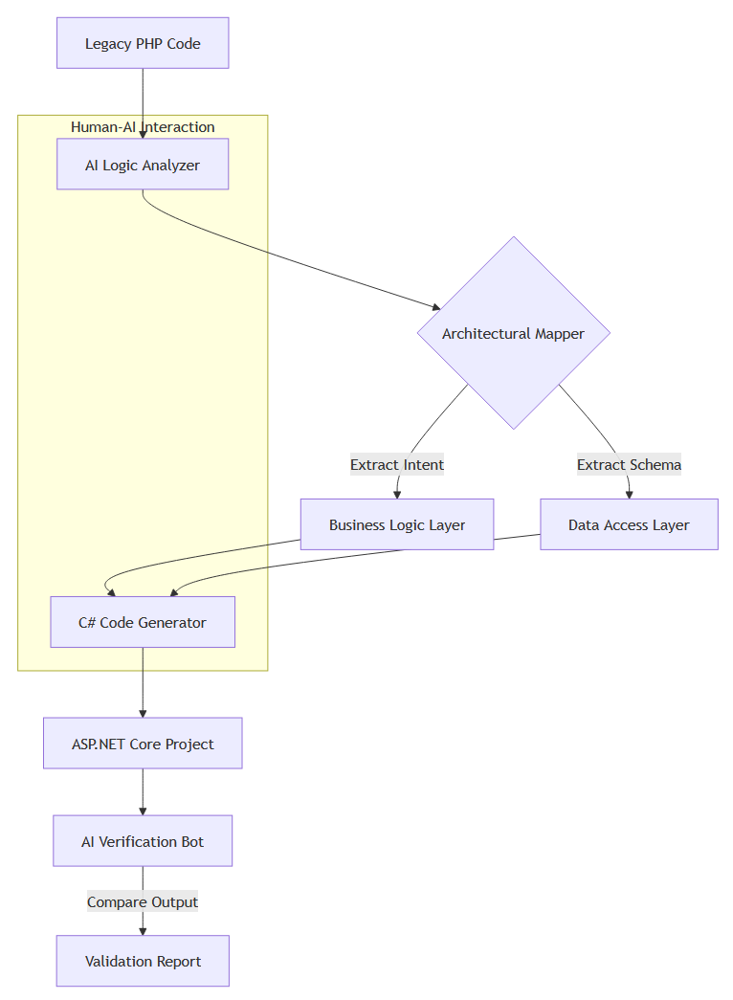

# Project Proposal: WebLegacy AI
## AI-Driven Web-Backend Modernization (PHP to C#)

**Team:** Aldin Memic & Amadin Six  
**Course:** KIS4 - AI-Assisted Software Engineering  
**Deadline Proposal:** 13.05.2026  
**Deadline Implementation & Presentation:** 29.05.2026

---

### 1. Goal of the Project
Das Ziel von **WebLegacy AI** ist die automatisierte Modernisierung von veraltetem (Legacy) PHP-Code in eine moderne, typsichere C# / ASP.NET Core Umgebung. 

#### High-Level Goal & Validation
*   **Ziel:** Transformation von monolithischem PHP-Code in eine saubere C# Architektur (Controller-Service-Repository Pattern). Es geht nicht um einfache Syntax-Übersetzung, sondern um den Erhalt der Geschäftslogik bei gleichzeitiger Verbesserung der Software-Qualität.
*   **Validierung:** 
    *   **Funktionale Korrektheit:** Vergleich der Rückgabewerte von PHP-Original und C#-Migration mittels KI-generierter Test-Suiten.
    *   **Architektur-Check:** Überprüfung, ob der generierte Code gängige .NET-Design-Patterns (Dependency Injection, Async/Await) korrekt nutzt.

#### System & Workflow
Das System arbeitet in einem dreistufigen Prozess:
1.  **Analysis:** Einlesen des PHP-Codes und Extraktion der "Business Intent" mittels LLM (Gemini/GPT).
2.  **Mapping:** Abbildung von PHP-Konstrukten (z.B. `mysqli_query`) auf moderne C#-Gegenstücke (z.B. Entity Framework Core).
3.  **Generation & Refinement:** Erstellung des ASP.NET Projekts und abschließendes KI-gestütztes Refactoring für optimale Lesbarkeit.

#### AI Assistance
*   **Modelle:** Google Gemini
*   **Einsatzbereiche:** 
    *   Extraktion von Logik aus unstrukturiertem Code.
    *   Generierung von C# Boilerplate und Mapping-Logik.
    *   Automatisierte Erstellung von Unit-Tests zur Verifikation.

---

### 2. Architecture Diagram

---

### 3. Project Plan
| Phase | Task | Deadline |
| :--- | :--- | :--- |
| **Proposal** | Finalisierung & Einreichung des Proposals | 13.05. |
| **Development I** | Prototyp: PHP Parsing & Simple Logic Translation | 17.05. |
| **Development II** | Datenbank-Mapping & Entity Framework Integration | 21.05. |
| **Development III** | Test-Generierung & Automatisierte Validierung | 25.05. |
| **Polish** | Bugfixing, Dokumentation & Präsentations-Vorbereitung | 27.05. |
| **Final** | **Präsentation & Projektabgabe** | **29.05.** |

---

### 4. Teamwork and Responsibilities
*   **Aldin Memic:** 
    *   Entwicklung der KI-Prompts für die Code-Analyse.
    *   Implementierung der Core Migration Engine (PHP to C# Logic).
    *   Setup des Basis-Frameworks.
*   **Amadin Six:**
    *   Definition der Ziel-Architektur (ASP.NET Patterns).
    *   Implementierung des Datenbank-Mappings (SQL zu EF Core).
    *   Entwicklung des Validierungs-Systems (Cross-Language Testing).

---

### 5. Requirements
*   **GitHub:** [Repository Link](https://github.com/kis4-2026ss/projekt-g1-memic-six)
*   **Stack:** Python/Node.js für das Tooling, C# für das Zielprojekt, Gemini API für die Intelligenz.
